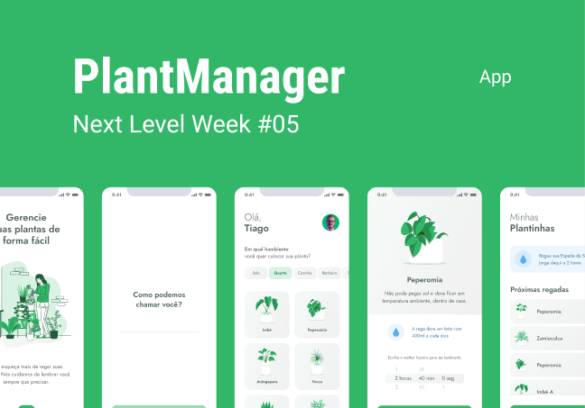

<h1>Projeto Plant Manager</h1>
<h2>Desenvolvido com mentoria de Rocketseat na jornada NLW#5</h2>

Esse é o projeto no qual estou desenvolvendo na Next Level Week da Rocketseat! O projeto é um app feito em React Native no qual o principal objetivo é ser um auxílio para que o usuário sempre lembre de regar suas plantas, tendo as específicações da planta, a quantidade de água recomendada, e um controle total de seu jardim!

<h5>O projeto será desenvolvido ao longo dessa semana do dia 19 de abril até o dia 25 de abril! Então aproveite para ver a evolução total do projeto :)</h5>
